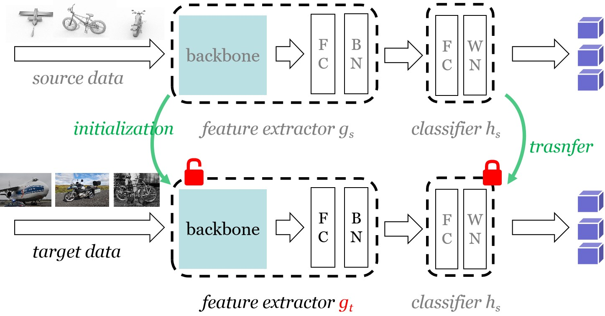

# Official implementation for **SHOT**

## [**[ICML-2020] Do We Really Need to Access the Source Data? Source Hypothesis Transfer for Unsupervised Domain Adaptation**](http://proceedings.mlr.press/v119/liang20a.html)


- **2022/2/8      We upload the pretrained source models via Google drive in [pretrained-models.md](./pretrained-models.md).**


### Attention-v2: ***we release the code of our recent black-box UDA method (DINE, https://arxiv.org/pdf/2104.01539.pdf) in the following repository (https://github.com/tim-learn/DINE).*** 

#### Attention: ***The code of our stronger TPAMI extension (SHOT++, https://arxiv.org/pdf/2012.07297.pdf) has been released in a new repository (https://github.com/tim-learn/SHOT-plus).*** 


### Results:

#### **Note that we update the code and further consider the standard learning rate scheduler like DANN and report new results in the final camera ready version.** Please refer [results.md](./results.md) for the detailed results on various datasets.

*We have updated the results for **Digits**. Now the results of SHOT-IM for **Digits** are stable and promising. (Thanks to @wengzejia1 for pointing the bugs in **uda_digit.py**).*


### Framework:  



### Prerequisites:
- python == 3.6.8
- pytorch ==1.1.0
- torchvision == 0.3.0
- numpy, scipy, sklearn, PIL, argparse, tqdm

### Dataset:

- Please manually download the datasets [Office](https://drive.google.com/file/d/0B4IapRTv9pJ1WGZVd1VDMmhwdlE/view), [Office-Home](https://drive.google.com/file/d/0B81rNlvomiwed0V1YUxQdC1uOTg/view), [VisDA-C](https://github.com/VisionLearningGroup/taskcv-2017-public/tree/master/classification), [Office-Caltech](http://www.vision.caltech.edu/Image_Datasets/Caltech256/256_ObjectCategories.tar) from the official websites, and modify the path of images in each '.txt' under the folder './object/data/'. [**How to generate such txt files could be found in https://github.com/tim-learn/Generate_list **]

- Concerning the **Digits** dsatasets, the code will automatically download three digit datasets (i.e., MNIST, USPS, and SVHN) in './digit/data/'.


### Training:
1. ##### Unsupervised Closed-set Domain Adaptation (UDA) on the Digits dataset
	- MNIST -> USPS (**m2u**)   SHOT (**cls_par = 0.1**) and SHOT-IM (**cls_par = 0.0**)
	```python
	 cd digit/
	 python uda_digit.py --dset m2u --gpu_id 0 --output ckps_digits --cls_par 0.0
	 python uda_digit.py --dset m2u --gpu_id 0 --output ckps_digits --cls_par 0.1
	```
	
2. ##### Unsupervised Closed-set Domain Adaptation (UDA) on the Office/ Office-Home dataset
	- Train model on the source domain **A** (**s = 0**)
    ```python
    cd object/
    python image_source.py --trte val --da uda --output ckps/source/ --gpu_id 0 --dset office --max_epoch 100 --s 0
    ```
	
	- Adaptation to other target domains **D and W**, respectively
    ```python
    python image_target.py --cls_par 0.3 --da uda --output_src ckps/source/ --output ckps/target/ --gpu_id 0 --dset office --s 0  
    ```
   
3. ##### Unsupervised Closed-set Domain Adaptation (UDA) on the VisDA-C dataset
	- Synthetic-to-real 
    ```python
    cd object/
	 python image_source.py --trte val --output ckps/source/ --da uda --gpu_id 0 --dset VISDA-C --net resnet101 --lr 1e-3 --max_epoch 10 --s 0
	 python image_target.py --cls_par 0.3 --da uda --dset VISDA-C --gpu_id 0 --s 0 --output_src ckps/source/ --output ckps/target/ --net resnet101 --lr 1e-3
	 ```
	
4. ##### Unsupervised Partial-set Domain Adaptation (PDA) on the Office-Home dataset
	- Train model on the source domain **A** (**s = 0**)
	```python
	 cd object/
	 python image_source.py --trte val --da pda --output ckps/source/ --gpu_id 0 --dset office-home --max_epoch 50 --s 0
	```

	- Adaptation to other target domains **C and P and R**, respectively
	```python
	 python image_target.py --cls_par 0.3 --threshold 10 --da pda --dset office-home --gpu_id 0 --s 0 --output_src ckps/source/ --output ckps/target/
	```
   
5. ##### Unsupervised Open-set Domain Adaptation (ODA) on the Office-Home dataset
	- Train model on the source domain **A** (**s = 0**)
	```python
	 cd object/
	 python image_source.py --trte val --da oda --output ckps/source/ --gpu_id 0 --dset office-home --max_epoch 50 --s 0
	```
	
	- Adaptation to other target domains **C and P and R**, respectively
	```python
	 python image_target_oda.py --cls_par 0.3 --da oda --dset office-home --gpu_id 0 --s 0 --output_src ckps/source/ --output ckps/target/
	```
	
6. ##### Unsupervised Multi-source Domain Adaptation (MSDA) on the Office-Caltech dataset
	- Train model on the source domains **A** (**s = 0**), **C** (**s = 1**), **D** (**s = 2**), respectively
	```python
	 cd object/
	 python image_source.py --trte val --da uda --output ckps/source/ --gpu_id 0 --dset office-caltech --max_epoch 100 --s 0
	 python image_source.py --trte val --da uda --output ckps/source/ --gpu_id 0 --dset office-caltech --max_epoch 100 --s 1
	 python image_source.py --trte val --da uda --output ckps/source/ --gpu_id 0 --dset office-caltech --max_epoch 100 --s 2
	```
	
	- Adaptation to the target domain **W** (**t = 3**)
	```python
	 python image_target.py --cls_par 0.3 --da uda --output_src ckps/source/ --output ckps/target/ --gpu_id 0 --dset office --s 0
	 python image_target.py --cls_par 0.3 --da uda --output_src ckps/source/ --output ckps/target/ --gpu_id 0 --dset office --s 1
	 python image_target.py --cls_par 0.3 --da uda --output_src ckps/source/ --output ckps/target/ --gpu_id 0 --dset office --s 2
	 python image_multisource.py --cls_par 0.0 --da uda --dset office-caltech --gpu_id 0 --t 3 --output_src ckps/source/ --output ckps/target/
	```
	
7. ##### Unsupervised Multi-target Domain Adaptation (MTDA) on the Office-Caltech dataset
	- Train model on the source domain **A** (**s = 0**)
	```python
	 cd object/
	 python image_source.py --trte val --da uda --output ckps/source/ --gpu_id 0 --dset office-caltech --max_epoch 100 --s 0
	```
	
	- Adaptation to multiple target domains **C and P and R** at the same time
	```python
	 python image_multitarget.py --cls_par 0.3 --da uda --dset office-caltech --gpu_id 0 --s 0 --output_src ckps/source/ --output ckps/target/
	```
	
8. ##### Unsupervised Partial Domain Adaptation (PDA) on the ImageNet-Caltech dataset without source training by ourselves (using the downloaded Pytorch ResNet50 model directly)
	- ImageNet -> Caltech (84 classes) [following the protocol in [PADA](https://github.com/thuml/PADA/tree/master/pytorch/data/imagenet-caltech)]
	```python
	 cd object/
	 python image_pretrained.py --gpu_id 0 --output ckps/target/ --cls_par 0.3
	```

**Please refer *./object/run.sh*** for all the settings for different methods and scenarios.

### Citation

If you find this code useful for your research, please cite our papers

```
@inproceedings{liang2020we, 
 title={Do We Really Need to Access the Source Data? Source Hypothesis Transfer for Unsupervised Domain Adaptation}, 
 author={Liang, Jian and Hu, Dapeng and Feng, Jiashi}, 
 booktitle={International Conference on Machine Learning (ICML)},  
 pages={6028--6039},
 year={2020}
}

@article{liang2021source,  
 title={Source Data-absent Unsupervised Domain Adaptation through Hypothesis Transfer and Labeling Transfer}, 
 author={Liang, Jian and Hu, Dapeng and Wang, Yunbo and He, Ran and Feng, Jiashi},   
 journal={IEEE Transactions on Pattern Analysis and Machine Intelligence (TPAMI)},
 year={2021}, 
 note={In Press}  
}
```


### Contact

- [liangjian92@gmail.com](mailto:liangjian92@gmail.com)
- [dapeng.hu@u.nus.edu](mailto:dapeng.hu@u.nus.edu)
- [elefjia@nus.edu.sg](mailto:elefjia@nus.edu.sg)
